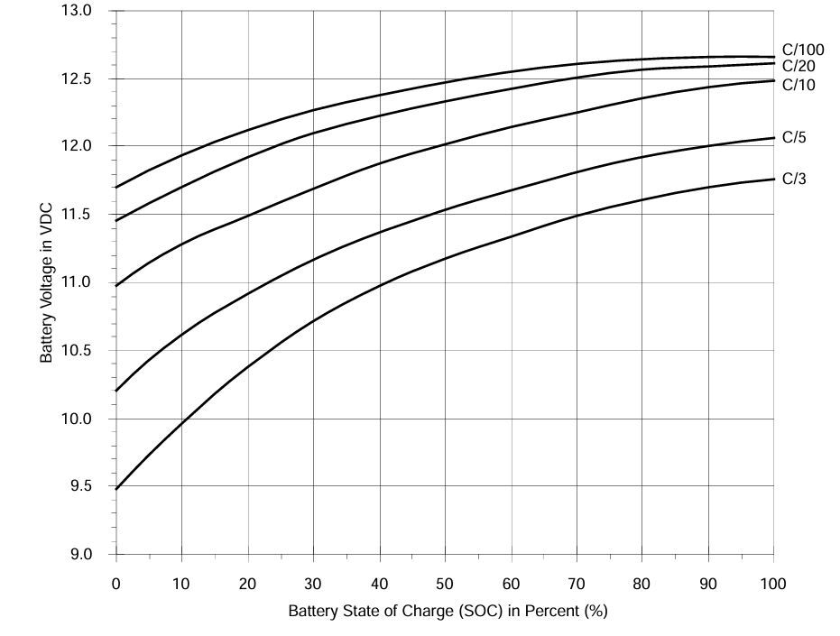
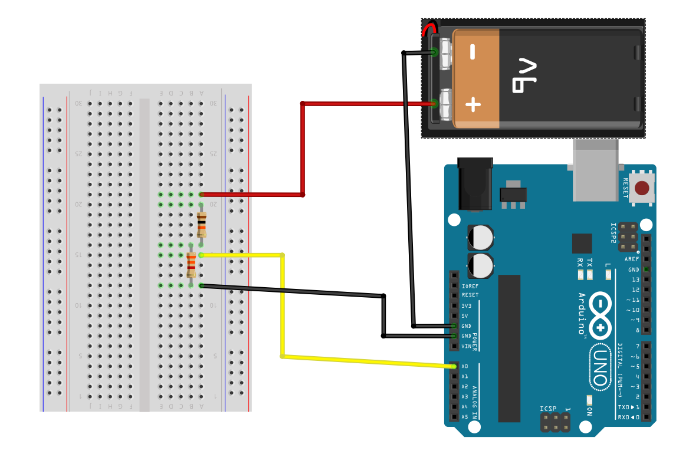

### Battery level measurement with Arduino

아두이노를 활용하여 12V 납축전지에 충전된 배터리 잔량을 측정하여 웹에 게시한다. 

#### 전압 기반 배터리 잔량 추정 (12V 납축전지)

많은 배터리 제조사의 데이터시트와 연구 논문에서 다음과 같은 전압 ↔ 잔량(%) 관계를 제시합니다.



| 전압      | 잔량 | 상태          |
| --------- | ---- | ------------- |
| 12.7(v)   | 100% | 완전충전      |
| 12.5      | 90%  |               |
| 12.4      | 80%  |               |
| 12.3      | 70%  |               |
| 12.2      | 60%  |               |
| 12.1(V)   | 50%  |               |
| 12.0(V)   | 40%  |               |
| 11.9      | 30%  |               |
| 11.8      | 20%  | 방전주의      |
| 11.7 이하 | 10%  | 완전방전 위험 |

**결선**

```
          +12V 배터리
              +
              |
              |
             [ R1 = 10kΩ ]
              |
              |-------> A0 (Arduino)
              |
             [ R2 = 3.3kΩ ]
              |
              |
             GND (배터리 (-)

```


**전압 산출식**


**Arduino Code for 12V 납축전지**

```c++
const int analogPin = A0;

// 분압 저항값
const float R1 = 10000.0;  // Ω
const float R2 = 3300.0;   // Ω

// 아두이노 기준 전압 (5V 보드 기준)
const float refVoltage = 5.0;

void setup() {
  Serial.begin(9600);
}

void loop() {
  int raw = analogRead(analogPin);

  // A0에 들어온 전압 계산
  float vA0 = raw * (refVoltage / 1023.0);

  // 실제 배터리 전압 계산 (분압 역산)
  float vBattery = vA0 * ((R1 + R2) / R2);

  // 잔량 퍼센트 계산
  float percent = estimateBatteryPercent(vBattery);

  // 시리얼 출력
  Serial.print("Battery Voltage: ");
  Serial.print(vBattery, 2);
  Serial.print(" V, Charge: ");
  Serial.print(percent, 0);
  Serial.println(" %");

  delay(1000);
}

float estimateBatteryPercent(float voltage) {
  if (voltage >= 12.7) return 100;
  else if (voltage >= 12.5) return 90;
  else if (voltage >= 12.4) return 80;
  else if (voltage >= 12.3) return 70;
  else if (voltage >= 12.2) return 60;
  else if (voltage >= 12.1) return 50;
  else if (voltage >= 12.0) return 40;
  else if (voltage >= 11.9) return 30;
  else if (voltage >= 11.8) return 20;
  else if (voltage >= 11.7) return 10;
  else return 0;
}
```


#### 전압 기반 배터리 잔량 추정 (9V 알카라인 or 망간 전지)


| 전압        | 잔량 | 상태                           |
| ----------- | ---- | ------------------------------ |
| 9.6(V) 이상 | 100% | 완전충전 (신품)                |
| 9.0(V)      | 80%  | 정상 작동 범위                 |
| 8.5         | 60%  | 일부 기기에서 성능 저하 가능성 |
| 8.0         | 40%  | 교체 고려 시점                 |
| 7.5         | 20%  | 대부분의 기기에서 작동 불가    |
| 7.0(V) 이하 | 0%   | 완전 방전 (교체 필요)          |

**결선**

```
          +9V 배터리(+)
              |
              |
             [ R1 = 10kΩ ]
              |
              +-------> A0 (Arduino)
              |
             [ R2 = 3.3kΩ ]
              |
              |
             GND (9V배터리 (-)

```




**전압 산출식**


**Arduino Code for 9V 알카라인 or 망간 전지**

```c++
const int analogPin = A0;

const float R1 = 10000.0;
const float R2 = 3300.0;
const float refVoltage = 5.0;

void setup() {
  Serial.begin(9600);
}

void loop() {
  int raw = analogRead(analogPin);
  float vA0 = raw * (refVoltage / 1023.0);
  float vBattery = vA0 * ((R1 + R2) / R2);
  float percent = estimateBatteryPercent(vBattery);

  Serial.print("Battery Voltage: ");
  Serial.print(vBattery, 2);
  Serial.print(" V, Charge: ");
  Serial.print(percent, 0);
  Serial.println(" %");

  delay(1000);
}

float estimateBatteryPercent(float voltage) {
  if (voltage >= 9.6) return 100;
  else if (voltage >= 9.0) return 80;
  else if (voltage >= 8.5) return 60;
  else if (voltage >= 8.0) return 40;
  else if (voltage >= 7.5) return 20;
  else if (voltage > 7.0) return 10;
  else return 0;
}

```


